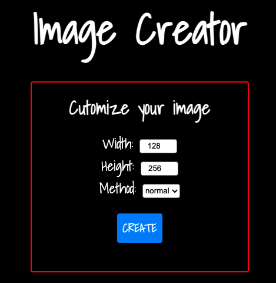
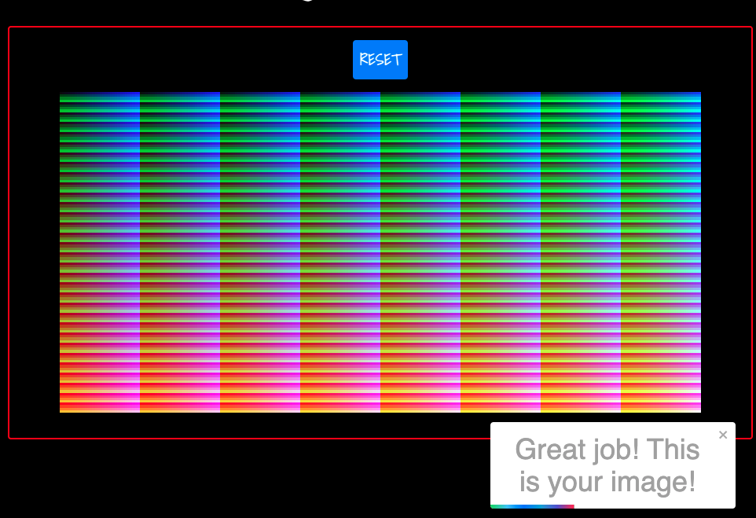
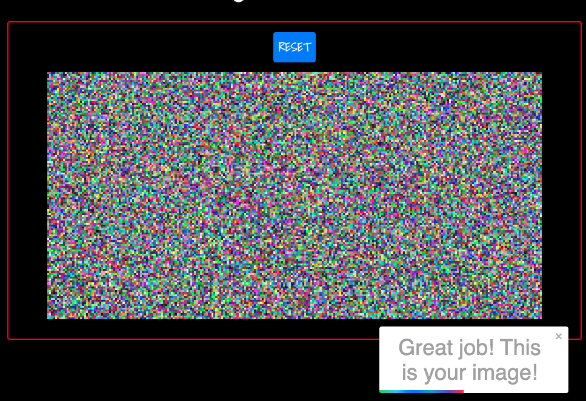

# Image Creator
**Image Creatoris** a single-page web application that can generate an image with 32,768 discrete colors and each colour occurs exactly once. [Try it on heroku!]()

This project was bootstrapped with [Create React App](https://github.com/facebook/create-react-app).

## Technologies
This project is created with:
* React.js

Technologies involved: 
* Heroku

## Demo
* **Width:**  The **width** of an image.
* **Height:**  The **height** of an image.
* **Method:** The method to distribute colors.
* **CREATE:** Generate an image based on user input data.

  
    
  
Use the normal method to generate image

  
    
  
Use the random method to generate image

  

## Test it in locally
In the project directory, you can run:
### `npm start`

Runs the app in the development mode.\
Open [http://localhost:3000](http://localhost:3000) to view it in the browser.

